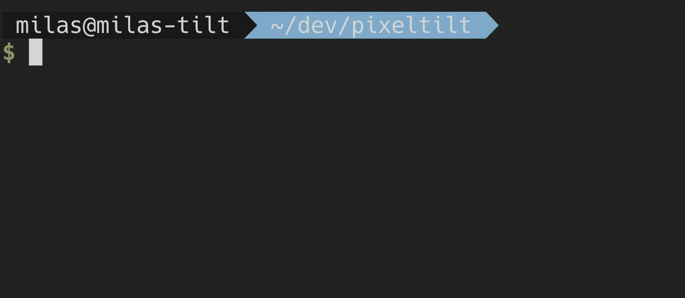
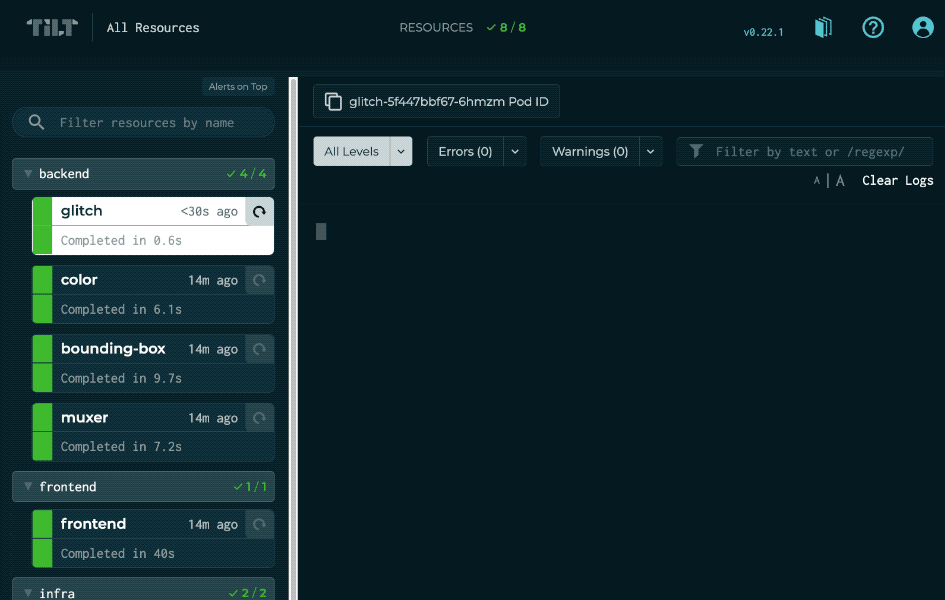
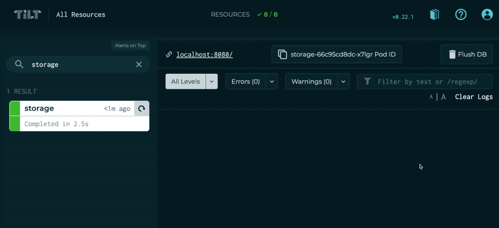

# PixelTilt
PixelTilt is a browser-based image editor. It is designed as demo project for [Tilt][tilt] and is comprised of several
microservices deployed via Kubernetes.

The [`Tiltfile`](https://github.com/tilt-dev/pixeltilt/blob/master/Tiltfile) contains comments and links to relevant
documentation.

## Getting Started
If you don't already have Tilt installed, follow the [Tilt install][tilt-install] guide.
> :information_source: The install guide also covers the prerequisites: Docker, `kubectl`, and a local Kubernetes development cluster

Once you're ready, clone this repo and run `tilt up` from the main `pixeltilt` directory.

After some time, the resources should all become ready. If a resource fails, click on it to navigate to the logs and
investigate. Once successful, try clicking the endpoint link for the `frontend` resource to start using the PixelTilt
app!

## Showcase
### Live Update
The `glitch` resource is configured to use [live update][live-update].

Try editing `filters/glitch/main.go` to use one of the commented out formulas instead and see what happens:

### Custom Buttons
The `storage` resource has a custom [UIButton][uibutton-ext] to make it easy to reset the application state.

When clicked, a `curl` command accesses a special endpoint on the microservice to flush the data:

[ctlptl]: https://github.com/tilt-dev/ctlptl

[live-update]: https://docs.tilt.dev/live_update_tutorial.html

[tilt]: https://github.com/tilt-dev/tilt

[tilt-install]: https://docs.tilt.dev/install.html

[uibutton-ext]: https://github.com/tilt-dev/tilt-extensions/tree/master/uibutton
